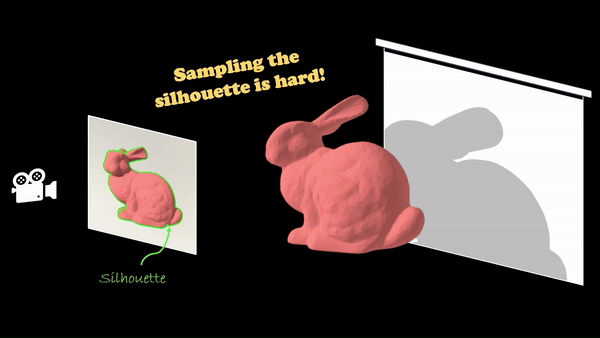

# A Simple Approach to Differentiable Rendering of SDFs

### [Project Page](https://zichenwang01.github.io/relaxed_boundary/) | [Paper](https://arxiv.org/abs/2405.08733) | [Data](https://drive.google.com/file/d/1V3xZqoWvdNVKO0SMT4dp42sdtKK17V8P/view?usp=drive_link)

<p align="center">
  
</p>

This repository contains an implementation for the SIGGRAPH Asia 2024 paper <a href="https://arxiv.org/abs/2405.08733">A Simple Approach to Differentiable Rendering of SDFs</a>.

We present a simple algorithm for differentiable rendering by expandibng the lower-dimensional boundary integral into a thin band that is easy to sample. This in turn makes it easy to integrate rendering into gradient-based optimization pipelines, enabling simple, robust, accurate, and efficient 3D reconstruction and inverse rendering.

## Installation
First create a new conda environment
```
conda create -n relax python=3.10
conda activate relax
```
Then install the following packages
```
pip install mitsuba==3.5
pip install numpy matplotlib fastsweep scikit-fmm scikit-image lpips
conda install -c conda-forge ffmpeg
```

Lastly, download the [data](https://drive.google.com/file/d/1V3xZqoWvdNVKO0SMT4dp42sdtKK17V8P/view?usp=drive_link) files and unzip it under the project folder.

## Optimization
To start running the codes, simply try 
```
python train.py --scene ficus
```
More generally, users can specify configurations, experiment name, and many other parameters (see the code for details) through
```
python train.py --scene <SCENE> --config <CONFIG> --name <EXP_NAME> --lr <LEARNING_RATE> --batch_size <BATCH_SIZE> --spp <SPP>
```
The required `--scene` argument specifies the target object, which should have the same name as the subfolder under `data/`. When `--config` is not specified, the code will run the `default.json` configuration. We also provide the `turbo.json` configuration for faster optimization on simpler objects. The `--name` argument specifies the experiment name, which is by default `%Y-%m-%d_%H-%M-%S`.

## Evaluation

After running `train.py`, we can evaluate the final results by
```
python evaluate/eval_all.py --scene<SCENE> --exp_dir <EXP_DIR>
```

Here the `--exp_dir` should be the path to the subfolder under `exp/`.

## Advanced Materials

### Code Structure

Here we provide a brief walkthrough of the code files in this project. 

- `data/`
    - For this codebase, we limit the data to be synthetic and within the unit cube.
    - Each subdirectory should contain the data needed for that one scene, which requires the following parts
      	- The shapes, usually as `obj` or `ply` files.
      	- The materials of the shapes, specified in the `XML` file.
      	- The light source, specified in the `XML` file.
      	- The `XML` file that specifies how the shapes, materials, and lighting are put together as a scene. Please see the <a href="https://mitsuba.readthedocs.io/en/latest/src/key_topics/scene_format.html"> XML file format</a> for more info.
- `configs/`
    - `default.json` is the default configuration.
    - `fast.json` provides a faster optimization configuration, often more suitable for only optimizing the geometry (e.g. vbunny).
- `evaluate/`
    - `eval_2d.py` evaluates novel view synthesis and relighting.
    - `eval_3d.py` evaluates the Chamfer distance.
    - `eval_inverse.py` evaluates the normal and albedo map.
    - `eval_all.py` calls the above three files to evaluate them all.
- `integrators/`
    - `base.py` contains the base integrator that is the superclass of all other custom integrators.
    - `direct.py` contains non-differentiable direct integrators
    - `direct_diff.py` contains differentiable direct integrators
    - `albedo.py`, `geometry.py`, and `normal.py` contain specialized integrators for inverse rendering evaluation.
- `utils.py` contains global parameters and utility functions.
- `sdf.py` implements the custom `SDF` class and sphere tracing functions.
- `train.py` is the main entry point for optimization. It loads the ground-truth synthetic scene and the cameras to render reference images, runs the main optimization loop, and saves parameters accordingly.

### Custom Data

In addition to the usual shape files and scene `XML` files, users should double-check that the target shapes are within the unit cube. We provide `render.py` for this quick check, which loads a scene and renders a single image from the front. The `XML` file should also contain a similar dummy placeholder as below if the textures are jointly optimized, and the `dummy_sdf` should be the first shape in the `XML` file.
```
<bsdf type="principled" id="main-bsdf">
	<texture type="volume" name="base_color">
		<volume type="gridvolume" name="volume">
			<string name="filename" value="./data/textures/red.vol"/>
		</volume>
	</texture>
	<texture type="volume" name="roughness">
		<volume type="gridvolume" name="volume">
			<string name="filename" value="./data/textures/gray.vol"/>
		</volume>
	</texture>
	<float name="specular" value="1.000000"/>
</bsdf>

<shape type="sphere" id="dummy_sdf">
	<transform name="to_world">
		<scale value="0.00001"/>
		<translate z="0"/>
		<translate y="20"/>
		<translate x="0"/>
	</transform>
	<ref id="main-bsdf" name="bsdf"/>
</shape>
```

### Custom Parameters

Here we list a few noteworthy parameters that are up to users' design choice
- `hide_env` decides to hide the environment map background or not.
- `num_sensor_theta` and `num_sensor_phi` specifies the sensor distribution. By default the sensors spread across the unit hemisphere, with `num_sensor_theta` sensors on the first row and `num_sensor_phi` rows of sensors. The number of sensors decreases as the row index increases.
- `spp_grad` specifies how many samples are backpropagated for gradient computation.
- `sdf_mode` determines either `linear` or `cubic` interpolation of the SDF grid. The `cubic` interpolation gives smooth geometry and is theoretically more robust, but it is also much slower than the `linear` interpolation.
- `sdf_eps` is the `eps` parameter in the paper, which controls the extent of relaxation.
- `sdf_deriv_eps` is the threshold on the SDF directional derivative

Well, looks like you have reached the bottom of this README; have fun playing with the codes!

## Citation
If you find our work useful in your research, please consider citing:

    @inproceedings{zichen2024relaxedboundary,
        author = {Wang, Zichen and Deng, Xi and Zhang, Ziyi and Jakob, Wenzel and Marschner, Steve},
        title = {A Simple Approach to Differentiable Rendering of SDFs},
        booktitle = {ACM SIGGRAPH Asia 2024 Conference Proceedings},
        year = {2024},
    }
